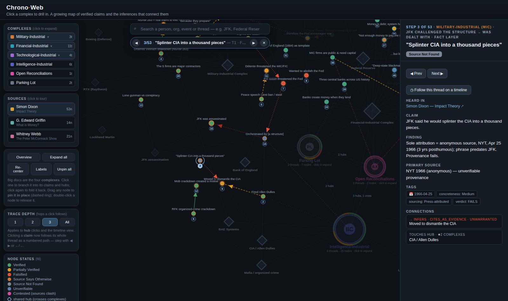

# TruthMap (the Chrono-Web)

**A growing, auditable map of podcast claims — decomposed into atomic facts and inferences, verified against primary sources, and woven into one interactive web.**

**▶ Live viewer: [nate824.github.io/TruthMap](https://nate824.github.io/TruthMap/)**



---

## The problem this solves

You listen to a 2+ hour podcast about the behind-the-scenes forces that steer the world. The host is confident, cites real-sounding sources, names real people and real documents — and by the end, recency bias has filed the whole argument under "true." Actually verifying everything they said would take days per episode. Nobody has that time, so nobody checks, and confident-sounding narratives compound unchecked.

TruthMap is a system for doing that verification **once, rigorously, and cumulatively**. Each podcast is decomposed into its load-bearing claims, each claim is chased down to primary sources, and the results are welded into a single shared web. When podcast #47 mentions the Federal Reserve, the work is already done — the new claims either land on existing verified nodes, sharpen them, or contradict them. The map gets *more* trustworthy as it grows, not noisier.

The core finding baked into the whole design: **the lie usually lives in the edge, not the node.** These arguments are typically stacks of individually-true facts welded together by a "therefore" the evidence doesn't earn. A fact-checker that only grades facts hands a well-sourced bad argument a glowing report card. So here, the *inferences between* facts are graded as first-class objects, separately from the facts themselves.

## What's in the web

| Object | What it is |
| :-- | :-- |
| **Complex** | A top-level "structure" — Military-Industrial (MIC), Financial-Industrial (FIC), Technological-Industrial (TIC), Intelligence-Industrial (IIC), plus **RX** (open cross-source conflicts) and a Parking Lot. |
| **Thread** | One sub-claim a speaker actually made, carrying a verdict: **FAILS / PARTIALLY HOLDS / LARGELY HOLDS / MIXED / OPEN**. |
| **Node** | An atomic claim (a fact, an interpretation, or framing) with a verification state: Verified, Partially Verified, Falsified, Misattributed, Source Not Found, Source Says Otherwise, Unverifiable. |
| **Edge** | An inferential move ("…therefore…") with its own grade: **Warranted / Weak / Unwarranted / NonSequitur**. |
| **Entity hub** | A recurring player, document, or event (the Fed, BlackRock, NSAM 263). Hubs are the web's junctions — where different speakers' stories cross over each other. |
| **Source** | Provenance for every thread: who said it, on what show, with a link. |

Currently mapped: **three podcasts** (Simon Dixon on Impact Theory; G. Edward Griffin on *What is Money?*; Whitney Webb on The Peter McCormack Show) — 27 threads, ~150 nodes, and the cross-source links between them.

## How to use the viewer

- **Big discs** are the complexes. Click one to branch it into its claims and hubs; click again to fold it back.
- **Click any claim node** and its whole thread lights up as a **numbered reading path** — premises first, then the interpretations built on them, then the framing, ending at the conclusion. Step through with ◀ ▶ or the arrow keys; everything off the path recedes, with one-hop "exits" kept faintly visible.
- **Sources menu** — click a podcast to tour *all* of its claims in order, claim by claim, across every thread it touches.
- **Diamonds are shared hubs** — the crossover points. Clicking one shows every thread that passes through it and lets you pick which to follow.
- **Search** a person, org, or event to enter Focus Mode: the subgraph laid out on a dated timeline.
- **The right panel** shows each claim's exact wording, the verification finding, tags, and — where the verifying document is online — direct **links to the primary sources used**.

Node **fill color** = verification state. Edge **color and dash** = inference grade. Green dotted cross-links = two sources corroborating each other; pink = sources in open conflict (collected in the RX complex rather than silently buried).

## Running locally

No build, no dependencies beyond a browser (D3 loads from a CDN):

```bash
git clone https://github.com/nate824/TruthMap.git
cd TruthMap
python3 -m http.server 8000   # then open http://localhost:8000
```

All data lives in [`chronoweb_data.js`](chronoweb_data.js) — the field reference is in its header comment. The full per-source verification write-ups live in [`breakdowns/`](breakdowns/).

---

# The research methodology

This is the exact process every claim in the map went through, posted in full so it can be challenged. If you think a node's state is wrong, an edge is graded too kindly or too harshly, or the method itself has a hole — [open an issue](../../issues). The canonical versioned copy lives in [`claim_verification_methodology.md`](claim_verification_methodology.md); how new sources get reconciled into the existing web (corroborate / clarify / contest / disprove) is specified in [`web_integration_protocol.md`](web_integration_protocol.md).

## 0. Purpose

Humans can't reliably hold onto claim → cited-source mappings, let alone go verify them. Recency bias + a confident host naming real-sounding sources makes us file a whole argument under "true." This process makes the checking cheap and the failure points explicit. It does **not** decide whether a conclusion is true; it shows *which parts are load-bearing, which are real, and where the argument actually breaks.*

## 1. The one principle everything hangs on

**The lie usually lives in the edge, not the node.** Conspiratorial arguments are typically a stack of individually-true (or true-ish) facts welded together by a "therefore" that the evidence doesn't earn. A checker that only grades facts will hand a well-sourced bad argument a glowing report card. **Grade the connections between facts as first-class objects.** True nodes + bad edge = the actual failure mode.

## 2. Object model

Everything decomposes into two object types:

- **Node** — an atomic claim. Either a fact ("JFK signed EO 11110") or an interpretation of a fact ("…which threatened the Fed").
- **Edge** — an inferential move connecting nodes ("…therefore the structure had him killed"). Edges carry their own verification burden, separate from the nodes they connect.

**Decompose every claim into a factual layer and an interpretive layer.** "He did X" and "X threatened them" are different nodes with different states. A single sentence is often a node *and* an edge fused — split it before classifying.

## 3. Taxonomy (two independent axes, not one bucket)

Tag every node on two axes (learned the hard way — a single A/B/C/D bucket mis-routes claims):

- **Concreteness** — is there a checkable fact? `High` / `Low`.
- **Sourcing** — `Named` (host cites a specific source) / `Implied` (public record exists) / `None`.

The sweet spot is **high-concreteness regardless of sourcing** — a checkable fact is checkable even if the speaker named no source (an inflated "Mag-7 ≈ 50% of the S&P" stat was high-concreteness / no-sourcing and still cleanly falsifiable).

Rough node families that fall out of the axes:

- **Concrete + named/implied** → fastest verifies (documents, statistics, attributions, historical existence).
- **Concrete + none** → needs source *discovery* first; beware "absence of found source ≠ false."
- **Low-concreteness / framing** → opinion or loaded interpretation; usually not a fact to verify.
- **Unfalsifiable** → no evidence could in principle disconfirm it. Tag and **walk away** — don't chase.

Edge types: `causal_inference`, `temporal`, `depends_on`, `cites_as_evidence`, `same_entity`.

## 4. Resolution states

### Node verification states

| State | Meaning |
| :-- | :-- |
| `Verified` | Source exists and says the thing. |
| `Partially Verified` | Supports part, or true with caveats the speaker dropped. |
| `Falsified` | Source exists and contradicts the claim. |
| `Misattributed` | The thing is real but wrong source / person / date. |
| `Source Not Found` | Couldn't locate the cited/implied source (≠ false). |
| `Source Says Otherwise` | Cited source is real but doesn't support — or undercuts — the claim. |
| `Unverifiable` | Unfalsifiable or out of scope by design. |

### Edge inference grades

| Grade | Meaning |
| :-- | :-- |
| `Warranted` | Inference follows given the node states. |
| `Weak` | Some support, but overstated or under-evidenced. |
| `Unwarranted` | Nodes don't license the conclusion. |
| `NonSequitur` | No logical connection at all. |

**Don't soft-pedal `Falsified` / `Source Says Otherwise`, and don't go easy on edge grades because the nodes turned out interesting.** Those are the highest-value findings the process produces.

## 5. The thread workflow (discipline mode)

Run one thread at a time, start to finish:

1. **Start at the top** — take the claim in the speaker's *exact words*.
2. **Decompose** into a node tree: factual layer (did X happen?) + interpretive layer (did X mean what's claimed?), and name the edge(s).
3. **Tag** each node (concreteness × sourcing) and each edge (type).
4. **Order the attack: facts → interpretations → framing → edge.** Always grade the edge *last*, because the inference depends on everything below it.
5. **Execute straight through.** Anchor the trivial node, verify the factual layer, then the interpretive layer, then the framing, then grade the edge (split causal edges into **E-motive** and **E-mechanism**).
6. **Verdict at the top** (see §7).

**Discipline rule:** once a thread is picked, refuse to stray until it resolves. "Done" = every node has a state and every edge has a grade. The thread isn't done because it got complicated or we got tired.

## 6. Working-doc structure

Maintain a living doc with two standing sections:

- **Active Thread** — the claim, its decomposition tree, the resolution log, the verdict.
- **Parking Lot** — every interesting tangent that is *not* the active thread. Tangents get parked, not chased. The parking lot persists across threads and isn't opened until the thread set is complete.

Resolved threads accumulate (one section each) so the set can later be compacted into the structured schema in `chronoweb_data.js`.

## 7. Verdict scale (per thread)

Summarize each resolved thread as one of:

- **FAILS** — a load-bearing node is `Falsified` and/or the edge is `Unwarranted`/`NonSequitur`. State *where exactly* the chain breaks.
- **PARTIALLY HOLDS** — real factual kernel, but the edge claims more than it earns (overstated/`Weak`).
- **LARGELY HOLDS** — nodes verify and the edge is `Warranted`; docks are precision-level only.

Always say *where* it breaks, not just that it does.

## 8. Sourcing & fairness rules

- **Primary sources where they exist** (executive-order and memo texts, congressional reports, SEC filings, central-bank publications, national archives); secondary only where primary is unavailable.
- **Capture the URL during verification.** Every node whose verifying source exists online carries clickable links in the viewer — only URLs actually consulted, never a plausible-looking guess.
- **Don't manufacture findings to reach a verdict.** If a node is genuinely `Unverifiable` or `Source Not Found`, mark it that way. Don't paper over a gap.
- **Stay fair when the speaker is right.** Credit a real kernel; dock only the overreach. A `Weak` edge with a legitimate core is not the same as an `Unwarranted` one — grade the difference. (Several conspiracy-coded claims in the map turned out simply *correct* — e.g. banks creating money as credit is standard central-bank description, and the map says so.)
- **Heavy downstream resources** (e.g. the JFK files) are reached *only* when a specific sub-node demands evidence they might contain — never as the entry point.

## 9. What failure looks like (observed signatures)

Three resolved threads, three distinct signatures — the texture a single "true/false" score would destroy:

| Thread | Verdict | Signature |
| :-- | :-- | :-- |
| JFK "challenged the structure → was dealt with" | **FAILS** | True facts, but the Fed-threat node `Falsified` and the mechanism `Unverifiable`; the strongest surviving motive (mafia) sits outside the thesis. |
| Earnings predict the next war zone | **PARTIALLY HOLDS** | Real analyst kernel (read the backlog) inflated into prediction; edge `Weak`, "they prepare" `Unwarranted`. |
| MIC roster + "war > defense contracts" | **LARGELY HOLDS** | Roster `Verified`, incentive `Warranted`; docks are precision only (volume ≠ margin; demand ≠ war). |

---

## When sources collide

At scale, different speakers make claims about the same reality. The web never overwrites anyone's claim — reconciliation happens through **typed cross-source links**: `corroborates` (confidence up), `clarifies` (a caveat added), `contests` (open standoff → an RX node stating the open question and *what evidence would resolve it*), and `disproves` (the only state-changing move, gated behind a primary-source-grade reason and a dated log entry). When in doubt, contest — reversible and honest — beats disprove. The full protocol, including the bucket tests and the agent pipeline for scaling to 100+ podcasts, is in [`web_integration_protocol.md`](web_integration_protocol.md).

## Contributing / criticizing

This project improves through attack. The most valuable contributions, roughly in order:

1. **Challenge a node state** — you know a primary source that verifies, falsifies, or corrects a claim currently marked otherwise. Open an issue naming the node and the source.
2. **Challenge an edge grade** — you think an inference is graded too kindly or too harshly. Argue it.
3. **Resolve an RX standoff** — the Open Reconciliations complex is the explicit research queue: standoffs waiting for decisive evidence.
4. **Add missing source links** — many verified nodes predate the URL-capture rule and cite sources by name only.
5. **Challenge the methodology itself** — if the process above has a systematic blind spot, that's the highest-leverage issue of all.
